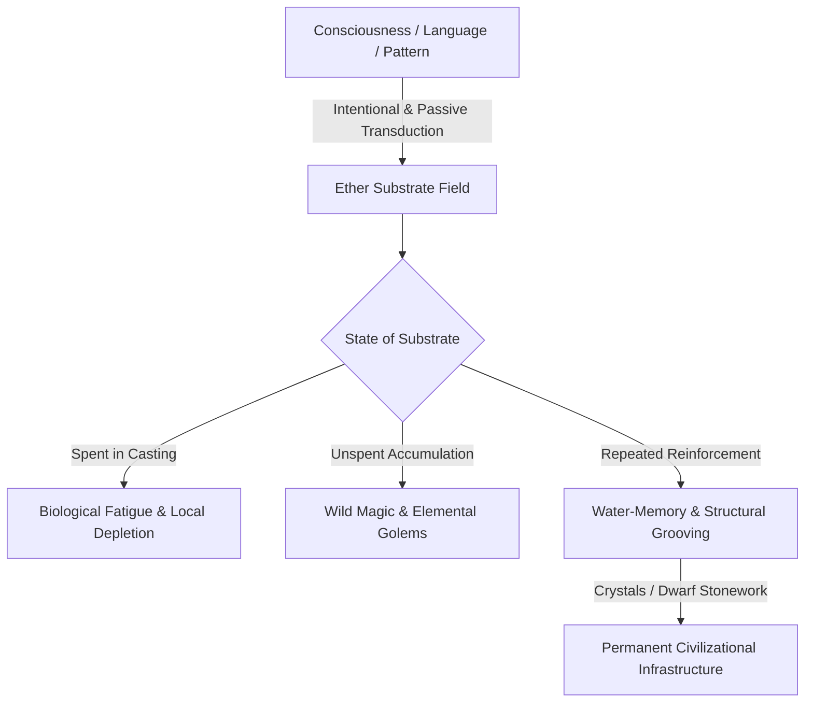

# Portfolio Case Study: "The Second Fire"
### A First-Principles Worldbuilding & Magic System Design

**Author**: Sontlux  
**Category**: Worldbuilding / System Design / World Concept Spec  
**Target Medium**: Interactive RPG / Worldbuilding Spec / Transmedia IP  


---

## 1. Executive Summary

Most fantasy magic systems fall into two traps:
1. **The Arbitrary List**: Magic as an ad-hoc collection of elemental spells with hand-waved rules.
2. **The Bloodline Lottery**: Magic as an innate genetic privilege reserved for "chosen ones."

**The Second Fire** takes a different approach: **First-Principles Derivation**. 
We ask one fundamental question:

> *"What if magic was a natural physical force—like electromagnetism—that co-evolved with human language and was harnessed like fire?"*

From this single premise, every rule of physics, every non-human species' biological adaptation, and six epochs of civilizational rise and collapse generate organically without hand-waving.

---

## 2. Core Physics: The 7 Laws of Cognitive Substrate

> [!IMPORTANT]
> **Substrate Mechanics**: Magic is not an abstract force of willpower; it is the responsiveness of reality's base layer (**Ether**) to **pattern**. Conscious minds configure it intentionally through language; non-conscious structures (crystals, DNA, river deltas) configure it passively.



### The 7 Derived Physical Laws

| Law # | Name | Operational Mechanic | World & Civilizational Consequence |
| :--- | :--- | :--- | :--- |
| **Law 1** | **Cognitive Substrate** | Ether responds to pattern and compositional structure. | Minds are densest organizers; crystals hold static memory. |
| **Law 2** | **Dual-Engine Cost** | Biological metabolic fatigue vs. Local ether depletion. | Innovation costs fatigue; heavy casting creates bleached deserts. |
| **Law 3** | **Carrying Capacity Overflow** | Unspent excess ether becomes unstable. | Dense cities must perform municipal liturgy to avoid wild magic. |
| **Law 4** | **Substrate Water-Memory** | Ether retains spell shapes; decays without reinforcement. | Megaliths and stonework serve as permanent memory drives. |
| **Law 5** | **Not Self-Evident** | Physical laws are invisible to inhabitants. | Empires build sacred rites & noble bloodline myths on wrong models. |
| **Law 6** | **Centrifugal Colleges** | High density + heavy casting = explosive wild magic. | Higher magical academies are forced into remote desert peaks. |
| **Law 7** | **Literacy Precondition** | Illiterate warbands blow up or get eaten by goblins. | Colonization requires written liturgy and structured load balancing. |

---

## 3. The 5 Derived Peoples

Rather than importing generic fantasy races, each species is derived directly as a **structural specialist** reacting to the 7 Laws of Substrate:

````carousel

<!-- slide -->

<!-- slide -->

<!-- slide -->

````

### 1. Elves — Generational Groovers & Monomaniacs
- **Lore**: Elves are not conservative traditionalists; they are monomaniacs driven by intense lifelong obsessions.
- **Physics Adaptation**: A young elf spends a century wandering (*dysphora*) sampling patterns before settling down to spend a millennium grooving a single location or concept.
- **Gameplay & Narrative Vector**: Extremely powerful in their chosen grove; helpless when displaced.

### 2. Dwarves — Terroir & Crystalline Cognition
- **Lore**: Dwarves do not hold magic inside their brains; they offload cognition into surrounding mineral lattices.
- **Physics Adaptation**: An Iron Dwarf thinks martial, directional thoughts; a Quartz Dwarf thinks vibrational memory. Migrating between minerals causes cognitive conversion trauma.
- **Gameplay & Narrative Vector**: Creators of non-decaying foundation stones. Human empires dig mines specifically to speciate new dwarven cognitions.

### 3. Goblins — Overflow-Riders & Terraformers
- **Lore**: Evolved inside wild magic zones, metabolizing surplus substrate.
- **Physics Adaptation**: Expand explosively into unspent ether pools with zero biological cost, but bleach the region and trigger wild magic collapses.
- **Gameplay & Narrative Vector**: Humanity's unwitting frontier terraformers.

### 4. Myrmedons — The Society IS The Spell
- **Lore**: Insectoid beings whose physical social arrangements act as massive standing spells.
- **Physics Adaptation**: A colony can summon rain across a kingdom, but growth outpaces structural novelty—causing self-annihilation if unchecked.
- **Gameplay & Narrative Vector**: Catastrophic natural cap forces older colonies to practice extreme civilizational restraint.

### 5. Humans — Portable Pattern & Contagious Tempo
- **Lore**: The only species combining grooving, building, innovation, and collective organization.
- **Physics Adaptation**: Invention of written liturgy decouples magic from geography—allowing human empires to scale at the speed of literacy.

---

Details of physical laws and historical engine are embedded in the interactive application.
